# Hallen-Legenden

[](https://hallenlegenden.de/)
[](LICENSE)

<p align="center"><a href="https://hallenlegenden.de">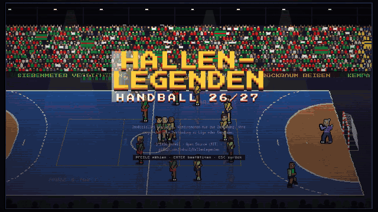</a><br><sub>Echte Szenen aus dem Spiel · real in-game footage · <a href="docs/presse/">mehr Clips / more clips</a></sub></p>

**[Screenshots](#screenshots) · [Pressekit / press kit](docs/presse/) · [Deutsch](#deutsch) · [English](#english)**

## Screenshots

Echte Aufnahmen aus dem Browserspiel. Für die volle Ansicht auf ein Bild klicken.

Actual browser gameplay and menus. Click any image to view it at full size.

| Spielgeschehen · Gameplay | Titelbildschirm · Title screen |
|:---:|:---:|
| [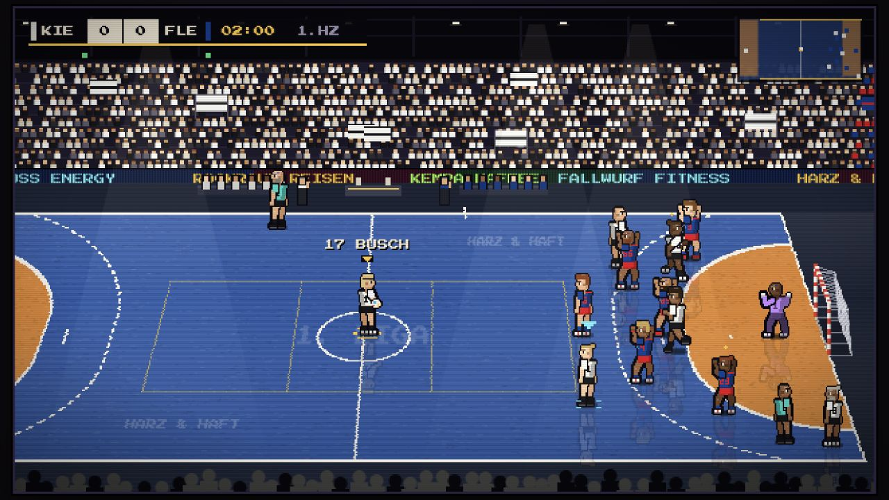](docs/screenshots/gameplay.jpg) | [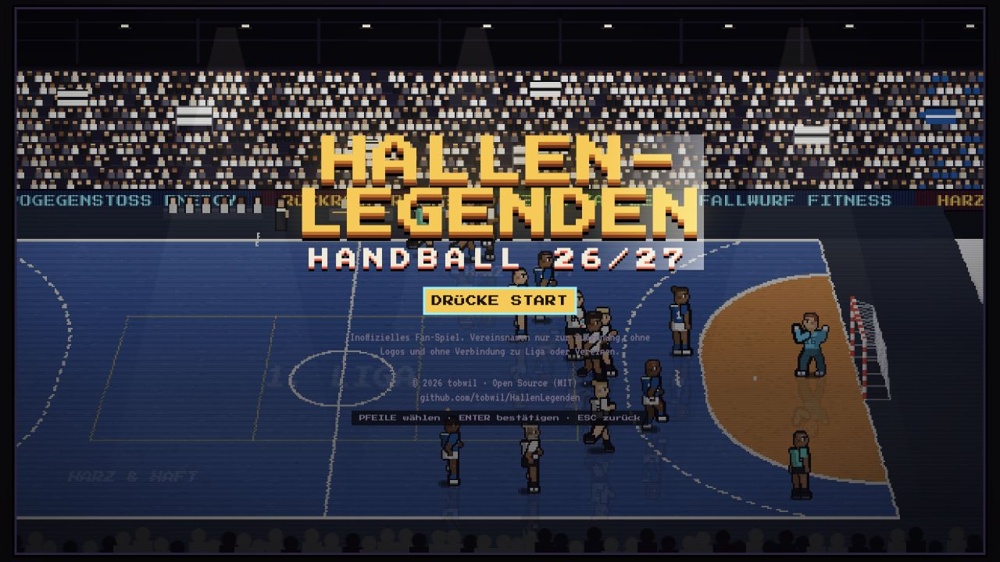](docs/screenshots/title-screen.jpg) |
| **Teamauswahl · Team selection** | **Karriere & Handball-Kurier · Career & newspaper** |
| [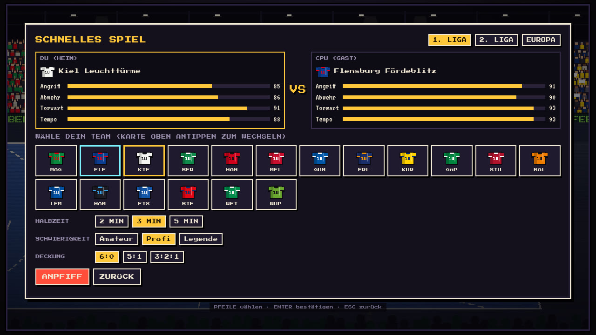](docs/screenshots/team-selection.jpg) | [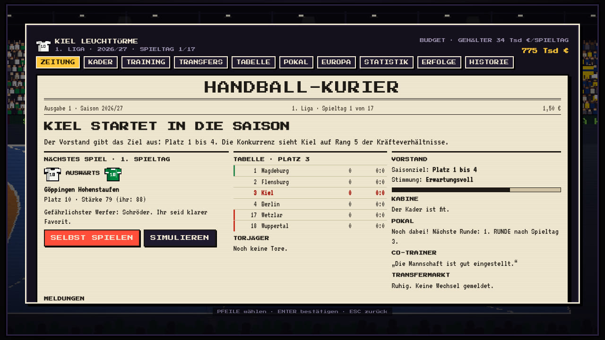](docs/screenshots/career-newspaper.jpg) |
| **Statistik · Statistics** | **Pokal · Cup bracket** |
| [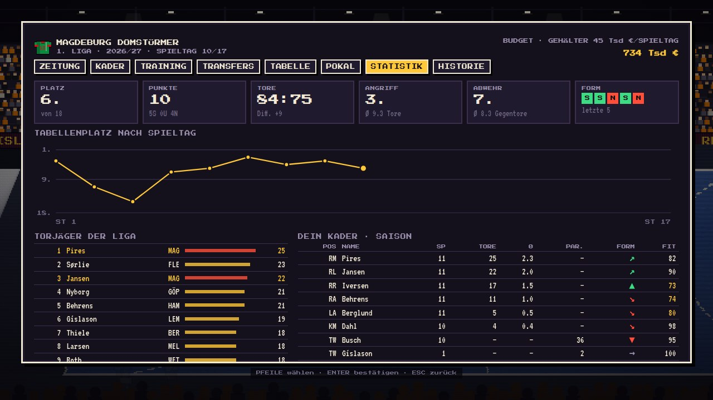](docs/screenshots/career-stats.jpg) | [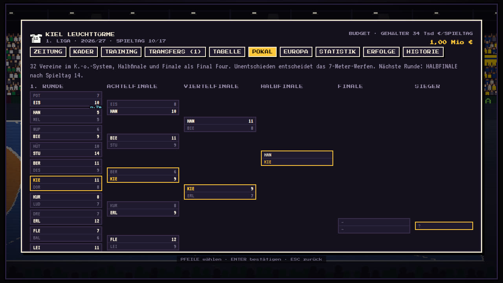](docs/screenshots/career-cup.jpg) |
| **Final Four** | **Europapokal · European cup** |
| [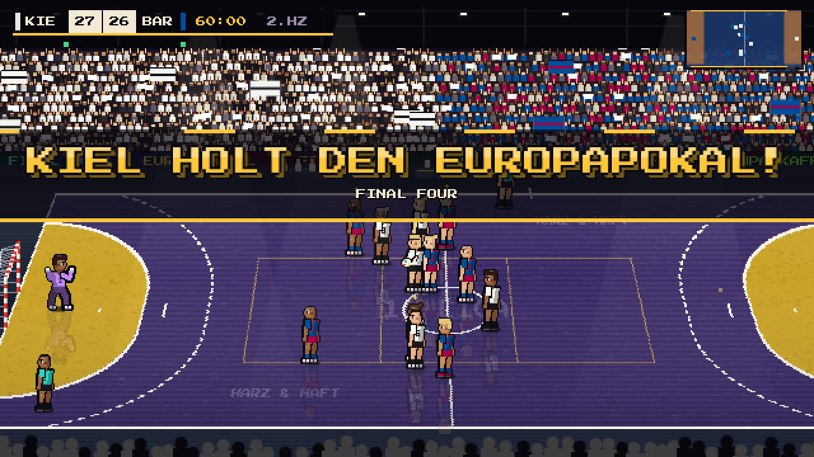](docs/screenshots/final-four.jpg) | [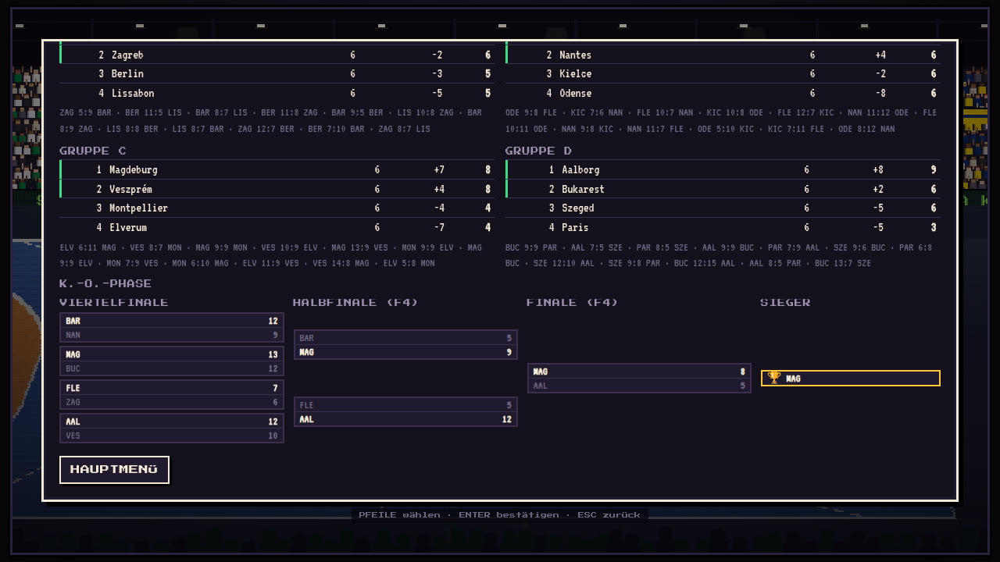](docs/screenshots/career-euro.jpg) |
| **Vor dem Spiel · Pre-match comparison** | **Erfolge · Achievements** |
| [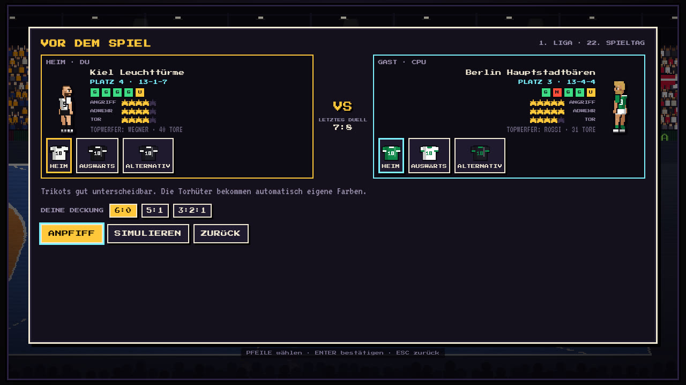](docs/screenshots/prematch.jpg) | [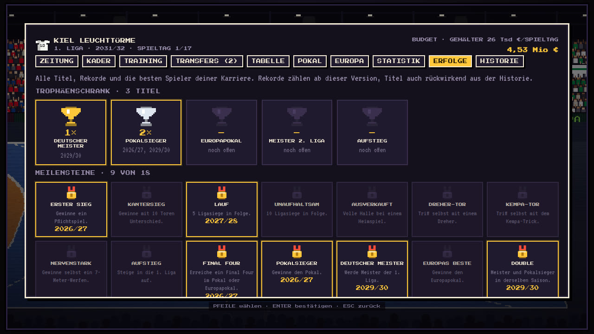](docs/screenshots/career-trophies.jpg) |
| **Kader mit Potenzial · Squad with potential** | **Karriere als Bild teilen · Share your career** |
| [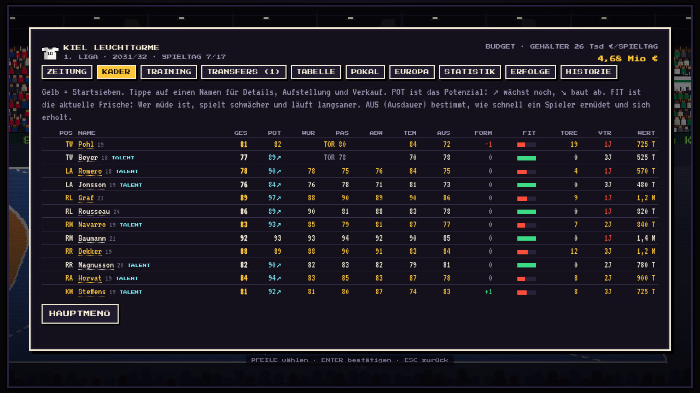](docs/screenshots/career-squad.jpg) | [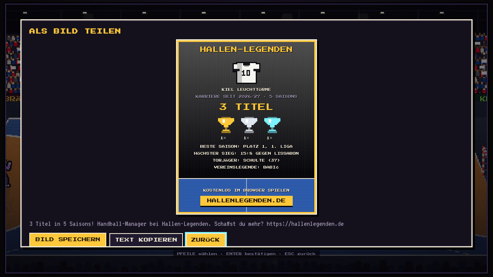](docs/screenshots/share-card.jpg) |
| **Spielerkarte · Player card** | **Scouting-Karte · Scouting card** |
| [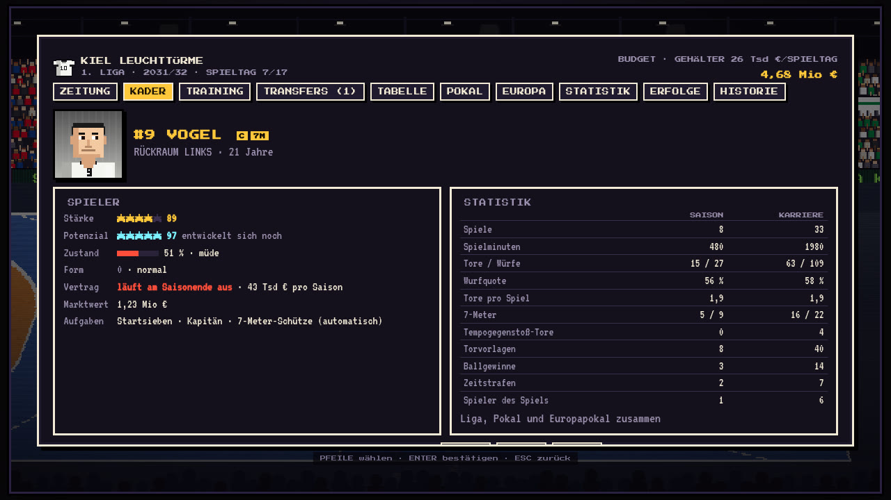](docs/screenshots/player-card.jpg) | [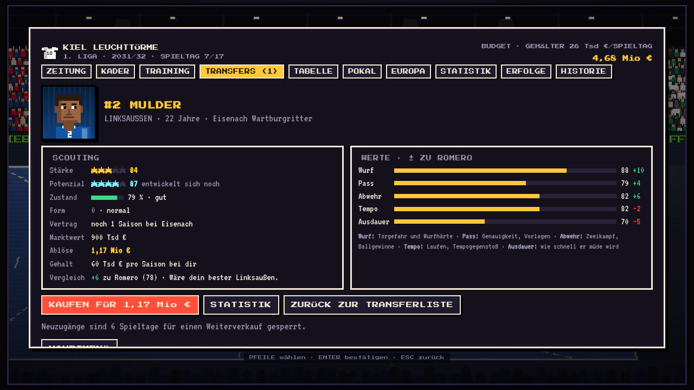](docs/screenshots/transfer-scout.jpg) |
| **Handy quer · Phone landscape** | |
| [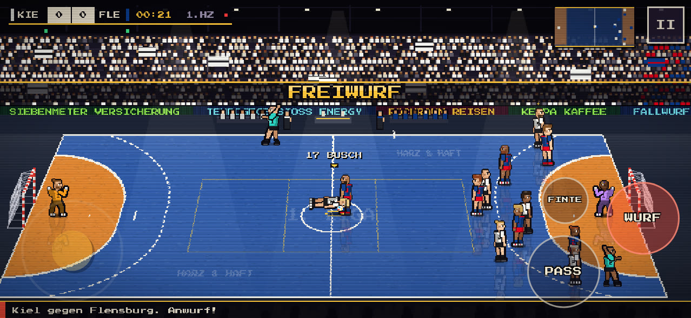](docs/screenshots/mobile.jpg) | |

---

<a id="deutsch"></a>

## Deutsch

Retro-Handball im Pixel-Look, inspiriert von *Legend Bowl*. Ein komplettes Browserspiel in einer einzigen HTML-Datei: kein Server, keine Installation, keine externen Abhängigkeiten außer zwei Google-Schriften.

**▶ Spielen: [hallenlegenden.de](https://hallenlegenden.de/)** · Wünsche und Ideen: [Wunsch-Formular](https://hallenlegenden.de/#wunsch)

Läuft am Desktop mit Tastatur oder Gamepad und auf dem Handy mit Touch-Steuerung (Querformat empfohlen, das Spielfeld nutzt auch breite Handys bis an den Rand). Offline geht es auch: `game/index.html` herunterladen und im Browser öffnen.

> Inoffizielles Fan-Projekt. Vereins- und Spielernamen sind Fantasienamen. Es gibt keine Logos und keine Verbindung zu einer Liga oder einem Verein. Im Editor lassen sich alle Namen und Farben lokal im eigenen Browser ändern.

### Was drin ist

#### Spiel
- **7 gegen 7** mit echten Handballregeln: 6-m-Torraum, Sprungwurf über den Kreis, Freiwurf an der 9-m-Linie, 7-Meter, 2-Minuten-Strafen, passives Spiel, Einwurf, Ecke, Abwurf und Team-Timeout
- **Aktionen:** Pass mit Vorschau (wer den Ball bekommt), Wurf mit Zielkreuz und Aufladen, Heber, Kempa-Trick, Finte, Ball herausspielen und Blocksprung
- **Torwart:** Paraden als „Hampelmann“ oder im Spagat. Beim 7-Meter rätst du als Torwart die Ecke
- **KI:** Abwehrsysteme 6:0, 5:1 und 3:2:1, Kreuzen im Rückraum, Einläufer, Tempogegenstoß, eigene Timeouts
- **Kraft und Auswechseln:** Spieler ermüden über die Spielzeit (Ausdauer bremst den Abbau). Wechsel per Menü (Q) oder automatisch über den Co-Trainer. Verletzungen nach Fouls
- **Schnelle Mitte** nach Toren, **Zeitlupe** bei Torchancen, **Wiederholung** nach jedem Tor
- **Pokal-K.-o.-Spiele** mit 7-Meter-Werfen bei Unentschieden (5 Schützen, dann Sudden Death)

#### Präsentation
- Pixel-Halle mit Perspektive: Dielenboden mit Spiegelungen, Tribünen mit Gästeblock und Doppelhaltern, La-Ola, Blitzlichter, LED-Banden, Lichtkegel, Trainerbänke und Schiedsrichter
- Prozedural gezeichnete Spieler-Sprites mit rund 20 Posen, Rückennummern, Frisuren und Porträts
- TV-Auftritt: Intro mit Aufstellungskarten, Anzeigetafel, Radar, Tor-Einblendung mit Torschützen-Karte, Halbzeit- und Endstatistik, Spieler des Spiels
- Sound vollständig synthetisiert (Web Audio): Hallenakustik, Publikum aus synthetischen Stimmen, Trommeln, Pfiff, Torhupe, Chiptune-Musik. Optional ein Hallensprecher über die Sprachausgabe des Browsers (standardmäßig aus)

#### Ligen und Karriere
- **36 Vereine** in zwei Ligen, Ligazugehörigkeit nach der Saison 2026/27, dazu **16 internationale Vereine** (alle mit Fantasienamen aus Stadt und Spitzname). Im Schnellen Spiel unter „EUROPA“ wählbar
- **Schnelles Spiel** mit Trikotwahl (Heim, Auswärts, Alternativ) und Warnung bei ähnlichen Farben
- **Vor dem Spiel:** Stärkevergleich beider Teams mit Sternen für Angriff, Abwehr und Tor, Topwerfer und Pixel-Spieler im gewählten Trikot. In der Karriere dazu Tabellenplatz mit Bilanz, Form der letzten fünf Spiele, Hinspiel oder letztes Duell und ein SIMULIEREN-Knopf
- **Karriere** über beliebig viele Saisons:
  - 6, 17 oder 34 Spieltage, Auf- und Abstieg zwischen beiden Ligen
  - 14er-Kader mit Werten für Wurf, Pass, Abwehr, Tempo, Torwart und Ausdauer, dazu Alter, Potenzial, Form und Fitness. Kader und Transferliste zeigen das Potenzial jedes Spielers mit Trend (↗ wächst noch, ↘ baut ab)
  - Spielerkarte mit Sternen für Stärke und Potenzial, Zustand, Vertrag und Aufgaben. Handball-Statistik je Spieler für Saison und Karriere: Tore und Würfe mit Wurfquote, 7-Meter, Tempogegenstoß-Tore, Torvorlagen, Ballgewinne, Zeitstrafen, Spieler des Spiels, bei Torhütern Paraden, Fangquote und gehaltene 7-Meter. 7-Meter-Schütze und Kapitän frei wählbar. Scouting-Karte für jeden Spieler der Transferliste: Vertrag beim jetzigen Verein, Ablöse, Gehalt bei dir, Statistik und Vergleich mit deinem Stammspieler auf der Position, Kauf direkt von der Karte
  - Training mit sechs Schwerpunkten, Spielerentwicklung und Karriereende, Jugendspieler rücken nach
  - Transfermarkt, Gehälter, Verträge mit Laufzeit und Verlängerung, Angebote anderer Vereine. Neuzugänge sind ein Drittel der Saison gesperrt, ein Sofortverkauf bringt 55 % des Marktwerts
  - Finanzen: Zuschauereinnahmen bei Heimspielen (Hallengröße, Tabellenplatz, Form, Gegner, Pokal), Sponsoren, TV-Geld nach Platz. Alles ist auf eine Saison geeicht, die Saisonlänge verändert die Bilanz nicht. Die CPU-Vereine wirtschaften nach denselben Regeln
  - CPU-Transfers (abschaltbar), Verletzungen
  - Vorstand mit Saisonziel: Bonus bei Erfolg, Warnung bei deutlichem Verfehlen, Entlassung beim zweiten Mal mit Jobangeboten anderer Vereine. Schulden bedeuten Transfersperre und nach einigen Spieltagen Notverkäufe
  - Co-Trainer für Aufstellung und Training (optional)
  - Pokal mit 32 Teams, Halbfinale und Finale als Final-Four-Wochenende in neutraler Halle mit eigener Präsentation und Pokalübergabe
  - Europapokal: Platz 1 und 2 der 1. Liga und der Pokalsieger treffen auf 13 internationale Vereine. Gruppenphase (4 × 4, Hin- und Rückspiel), Viertelfinale, Final Four am Saisonende. Bei 6 Spieltagen kompakt mit 8 Vereinen. Prämien und Zuschauereinnahmen, eigener Tab mit Gruppen und Turnierbaum
  - Jede Partie selbst spielen oder simulieren
  - Zeitung „Handball-Kurier“ mit Schlagzeilen, Tabelle, Torjägern und Meldungen
  - Erfolge: Trophäenschrank mit allen Titeln, Rekorde (höchster Sieg, längste Siegesserie, meiste Tore in einem Spiel, beste Saison, Zuschauerrekord und mehr) und eine Ehrenhalle mit den Vereinslegenden
  - Saisonbilanz und Karriere als Pixel-Bild teilen (am Handy direkt per WhatsApp und Co., sonst als Bild speichern)
- **Editor** für Vereinsnamen, Kürzel, Trikotfarben, Spielernamen und Nummern
- **Speichern:** laufende Spiele automatisch und per „Speichern & Beenden“, Karriere dauerhaft im Browser (`localStorage`)

### Steuerung

Rechte Hand auf den Pfeiltasten zum Laufen, linke Hand auf WASD und Leertaste für die Aktionen.

| Taste | Angriff | Abwehr |
|---|---|---|
| Pfeile | Laufen | Laufen |
| W / Shift | Sprint | Sprint |
| S | Pass (Richtung = Laufrichtung) | Spieler wechseln: erst zum ballnächsten, mehrmals drücken = der Nähe nach weiter |
| A | Kempa-Trick (auch Shift + S) | wie S |
| Leertaste | Wurf (antippen = schnell, halten = mehr Wucht, hoch/runter = Ecke) | Blocksprung |
| D | Finte, beim Aufladen: Heber | Ball herausspielen |
| T | Team-Timeout (Deckung umstellen) | |
| Q | Wechselmenü | |
| Esc / P | Pause, im Menü: zurück | |
| M | Ton an/aus | |

J, K und L funktionieren weiterhin als Alternative für Pass, Wurf und Finte.

In der Abwehr und bei freiem Ball steuerst du ohne Wechseltaste automatisch den ballnächsten Spieler. Nach einem Wechsel per Taste bleibt die Automatik kurz aus.

**Menüs:** Pfeiltasten wählen, Enter bestätigt, Esc oder Backspace geht zurück.

**Gamepad:** A Pass, X Wurf, B Finte/Klau, RB Sprint, Start Pause. Im Menü: Steuerkreuz wählen, A bestätigen, B zurück. Links/rechts ändert Lautstärke-Regler und Vereinsliste (gehalten geht es schneller). Trikotfarben: A drücken, dann links/rechts, mit A oder B fertig. Das ganze Spiel ist ohne Maus und Tastatur bedienbar, die Hinweise zeigen dann die Controller-Tasten.

**Touch (Handy):**
- Stick erscheint dort, wo der Daumen links aufsetzt. Voll ausgelenkt sprintet der Spieler
- Antippen: Mitspieler = Pass zu ihm, Tor = Wurf in diese Ecke, in der Abwehr Spieler = zu ihm wechseln. Ein Tipp in den ersten beiden Spielen erklärt das
- Knöpfe je nach Lage: PASS/WURF/FINTE oder WECHSEL/BLOCK/KLAU. Langer Druck auf PASS spielt Kempa. Im Ruhezustand sind die Knöpfe durchscheinend, damit man das Feld darunter sieht; die Größe (klein, normal, groß) steht unter Optionen
- Pause (II) oben rechts, Zurück-Leiste in allen Menüs

### Projektstruktur

```
index.html            Landingpage mit Horizontal-Scroll und Wunsch-Formular
game/index.html       das Spiel (wird von build.sh erzeugt)
spielen.html          Weiterleitung auf game/ für alte Links
impressum.html        Impressum
datenschutz.html      Datenschutzerklärung
assets/               Story-Film, Umzugs-Skript, Styles und Kontakt-Skript für Impressum und Datenschutz
fonts/                Schriften lokal (Press Start 2P, VT323, SIL OFL)
tools/                Google-Apps-Script für die Wunschliste, tools/promo: Teaser, Spielclips, GIFs und Screenshots neu aufnehmen
netlify.toml          Einstellungen für Netlify (Hosting von hallenlegenden.de)
hallen-legenden.html  dieselbe Seite ohne <html>-Gerüst (für die Veröffentlichung als Claude-Artifact)
src/                  Quellcode in Modulen, wird per build.sh zusammengesetzt
docs/screenshots/     echte Spielaufnahmen für README und Landingpage
docs/presse/          Pressekit: Teaser, Spielclips (Final Four, Aufstellungen, Europapokal), GIFs, Kurzbeschreibung, Profilbild und Banner
docs/LANDINGPAGE.md   Landingpage, Wunsch-Formular und eigene Domain einrichten
docs/ARCHITEKTUR.md   Aufbau des Codes, Datenmodell, Speicher-Schlüssel
docs/ENTWICKLUNG.md   Entwicklungsgeschichte: Wünsche, Entscheidungen, Tests
CHANGELOG.md          Versionen
LICENSE               Lizenz (PolyForm Noncommercial 1.0.0)
```

#### Bauen

Die Module in `src/` werden in fester Reihenfolge zu einer HTML-Datei zusammengesetzt:

```sh
sh src/build.sh
```

Das erzeugt `game/index.html` und `hallen-legenden.html`. Die Landingpage `index.html` wird von Hand gepflegt. Es gibt keinen Bundler und keine Paketabhängigkeiten. Für einen Syntax-Check reicht `node --check` auf die zusammengefügten JS-Dateien.

#### Plattform-Schnittstelle

Im Browser speichert das Spiel in `localStorage`. Eine Hülle wie eine Desktop-Version kann vor dem Spiel `window.HL_PLATFORM` setzen und damit Folgendes ersetzen oder ergänzen (alles optional, siehe `src/p01_core.js`):

| Feld | Zweck |
|---|---|
| `name` | Name der Plattform, im Browser `'web'` |
| `storage` | Speicher mit `getItem`, `setItem`, `removeItem`, synchron wie `localStorage` |
| `event(name, data)` | bekommt dieselben Ereignisse wie die Statistik, zum Beispiel `spiel-ende` mit `{ ergebnis }` und `titel` mit `{ art }` (`meister`, `pokal`, `euro`, `meister2`, `aufstieg`) |
| `quit()` | zeigt BEENDEN im Hauptmenü |
| `legal` | ersetzt die Copyright-Zeile auf dem Titelbildschirm |

#### Tests

Regressionstests für das Spiel liegen in `tests/` (Playwright mit Chromium). Sie laufen Frame für Frame mit festem Zufall und prüfen unter anderem Tastenbelegung, Pässe, Eingabepuffer, Spielerwechsel, ein komplettes Spiel, Karriere mit Pokal und Europapokal, Finanzen, Potenzial, Erfolge und Teilen-Bild, Vergleich vor dem Spiel, Editor, Menüfenster, Handy-Steuerung und Darstellung auf breiten Bildschirmen. Nach `sh src/build.sh` und vor jedem Merge:

```sh
cd tests
npm install                          # einmalig
npx playwright-core install chromium # einmalig, falls noch kein Chromium da ist
npm test                             # alle 43 Tests, etwa eine Minute
npm test -- pass zoom                # nur Tests, deren Name diese Wörter enthält
GAME=https://deploy-preview-14--hallenlegenden.netlify.app/game/ npm test   # gegen eine Netlify-Vorschau
npm run tief                         # 9 tiefe Tests, etwa drei Minuten (vor größeren Versionen)
ALT=pfad/zur/alten/index.html npm run tief -- update   # Update-Test gegen eine bestimmte Vorversion
```

Die tiefen Tests (`tests/tief.mjs`) prüfen, was in kurzen Tests nicht auffällt:
- Dauerlauf über 18 Saisons mit Transfers, Auf- und Abstieg und Entlassung. Nach jedem Spieltag wird der ganze Spielstand auf Widersprüche geprüft (Kader, Tabelle, Geld, Werte), nach jeder Saison Speichern und Laden.
- Laufende Spiele speichern und nach dem Neuladen fortsetzen, ohne dass ein Ergebnis doppelt zählt.
- Zufallsklicks durch alle Menüs und Spiele, eine Saison wirklich gespielt, 11 Bildschirmgrößen von 320 px bis Full HD, beschädigte Spielstände und das Tempo pro Bild.
- Update von der Vorversion: Spielstände entstehen in der bisherigen Version (`origin/main`, oder `ALT=` Datei bzw. URL) und werden in der neuen weitergespielt, wie bei Spielern nach einem Deploy: laufendes Spiel, inzwischen simuliertes Pokalspiel, Karriere und Einstellungen.

Die `package.json` liegt bewusst nur in `tests/`, damit Netlify beim Veröffentlichen nichts installiert.

#### Als Website veröffentlichen

Die Seite läuft unter [hallenlegenden.de](https://hallenlegenden.de/) bei Netlify, direkt aus dem Branch `main` ohne Build-Schritt (`netlify.toml`). Die Landingpage liegt im Hauptordner, das Spiel unter `/game/`.

Die alte Adresse [tobwil.github.io/HallenLegenden](https://tobwil.github.io/HallenLegenden/) (GitHub Pages) leitet automatisch auf hallenlegenden.de weiter und nimmt dabei vorhandene Spielstände mit (`assets/umzug.js`). Details zu Formular, Domain und Umzug stehen in [docs/LANDINGPAGE.md](docs/LANDINGPAGE.md).

### Entstehung

Das Spiel hat **tobwil** im Dialog mit Claude (Anthropic) in Claude Code entwickelt: von einer ersten Version mit fiktiven Teams über die Pixel-Halle, die Ligen 2026/27 und den Manager-Modus bis zur Touch-Steuerung. Den Verlauf mit allen Wünschen, Entscheidungen und Tests beschreibt [docs/ENTWICKLUNG.md](docs/ENTWICKLUNG.md), die Versionen stehen in [CHANGELOG.md](CHANGELOG.md).

### Lizenz, Name und Namensnennung

Der Code steht unter der [PolyForm Noncommercial License 1.0.0](LICENSE), © 2026 [tobwil](https://github.com/tobwil). Der Quellcode ist offen einsehbar, das Spiel ist aber nicht für kommerzielle Zwecke freigegeben.

**Erlaubt** ist alles, was nicht kommerziell ist: das Spiel spielen, den Code lesen und daraus lernen, ihn verändern, eigene Versionen bauen und kostenlos weitergeben. Auch gemeinnützige Organisationen, Schulen, Vereine und Hochschulen dürfen es nutzen. **Bedingung:** Der Urheberhinweis „Copyright (c) 2026 tobwil“ und der Lizenztext (oder der Link darauf) müssen in allen Kopien und abgeleiteten Versionen erhalten bleiben.

**Nicht erlaubt** ist jede kommerzielle Nutzung, zum Beispiel das Spiel oder eine darauf basierende Version zu verkaufen, in einem App-Store gegen Geld oder mit Werbung und In-App-Käufen anzubieten oder in ein kommerzielles Produkt einzubauen. Wer das vorhat, braucht eine eigene Lizenz von tobwil (Kontakt über das [Impressum](https://hallenlegenden.de/impressum.html)).

Versionen bis einschließlich v8.11 wurden unter der MIT-Lizenz veröffentlicht. Für Kopien dieser älteren Versionen gilt weiterhin die MIT-Lizenz, für alle späteren Versionen gilt die PolyForm Noncommercial License.

**Name und Logo sind von der Lizenz ausgenommen.** Der Name „Hallen-Legenden“ und das Logo (der Schriftzug des Spiels) gehören nicht zum lizenzierten Code und bleiben tobwil vorbehalten. Das gilt auch für andere Schreibweisen und verwechselbare Abwandlungen, zum Beispiel „Hallenlegenden“, „Hallen Legenden“, „Legenden der Halle“, „Hall Legends“ oder „Hallen-Legenden 2“, und für die Domain hallenlegenden.de.

Wer eine veränderte Version veröffentlicht (zum Beispiel als Website, App oder Download):
- muss ihr einen anderen Namen geben, der sich klar von „Hallen-Legenden“ unterscheidet,
- darf nicht den Eindruck erwecken, es handle sich um das offizielle Spiel oder um eine von tobwil unterstützte Version.

Erlaubt und erwünscht ist ein Hinweis auf die Herkunft, etwa *„Basiert auf Hallen-Legenden von tobwil“* mit Link auf dieses Repository. Ein Fork hier auf GitHub, um Änderungen beizutragen oder auszuprobieren, darf den Namen des Repositorys behalten.

---

<a id="english"></a>

## English

Retro handball in pixel style, inspired by *Legend Bowl*. A complete browser game in a single HTML file: no server, no installation, no external dependencies apart from two Google Fonts.

**▶ Play: [hallenlegenden.de](https://hallenlegenden.de/)** · Ideas and requests: [feature request form](https://hallenlegenden.de/#wunsch) (German)

Runs on desktop with keyboard or gamepad and on phones with touch controls (landscape recommended; the pitch fills wide phone screens edge to edge). Works offline too: download `game/index.html` and open it in your browser.

The game itself is in **German** (menus, commentary, newspaper). The controls below are all you need to get started.

> Unofficial fan project. Club and player names are fictional. There are no logos and no affiliation with any league or club. All names and colours can be changed locally in your own browser using the built-in editor.

### Features

#### Gameplay
- **7 vs 7** with real handball rules: 6 m goal area, jump shots over the line, free throw at the 9 m line, 7 m penalties, 2-minute suspensions, passive play, throw-ins, corners, goalkeeper throws and team timeouts
- **Actions:** pass with preview (shows who receives the ball), shot with aiming reticle and charge-up, lob, Kempa trick, feint, stealing the ball and block jump
- **Goalkeeper:** saves as "starfish" or in the splits. On a 7 m penalty you guess the corner as the keeper
- **AI:** 6-0, 5-1 and 3-2-1 defence systems, back-court crossings, wing cut-ins, fast breaks, its own timeouts
- **Stamina and substitutions:** players tire over the course of the match (stamina slows the decline). Substitute via menu (Q) or automatically through the assistant coach. Injuries after fouls
- **Quick throw-off** after goals, **slow motion** on scoring chances, **replay** after every goal
- **Cup knockout matches** with a penalty shoot-out on a draw (5 shooters, then sudden death)

#### Presentation
- Pixel arena with perspective: wooden floor with reflections, stands with away section and banners, Mexican wave, camera flashes, LED boards, spotlights, team benches and referees
- Procedurally drawn player sprites with around 20 poses, shirt numbers, hairstyles and portraits
- TV-style presentation: intro with line-up cards, scoreboard, radar, goal overlay with scorer card, half-time and full-time stats, player of the match
- Fully synthesised sound (Web Audio): arena acoustics, crowd made of synthetic voices, drums, whistle, goal horn, chiptune music. Optional stadium announcer via the browser's speech synthesis (off by default)

#### Leagues and career
- **36 clubs** in two leagues, league membership based on the 2026/27 season, plus **16 international clubs** (all with fictional names made of city and nickname). Selectable under “EUROPA” in quick match
- **Quick match** with kit choice (home, away, alternate) and a warning for similar colours
- **Before the match:** side-by-side comparison with stars for attack, defence and goalkeeping, top scorer and a pixel player in the chosen kit. In career mode also table position and record, form over the last five matches, first leg or last meeting and a SIMULATE button
- **Career** over as many seasons as you like:
  - 6, 17 or 34 matchdays, promotion and relegation between both leagues
  - 14-player squad with ratings for shooting, passing, defence, pace, goalkeeping and stamina, plus age, potential, form and fitness. Squad and transfer list show every player's potential with a trend (↗ still improving, ↘ declining)
  - Player card with stars for rating and potential, condition, contract and roles. Handball stats per player for the season and the career: goals and shots with shooting percentage, penalties, fast-break goals, assists, steals, two-minute suspensions, player of the match, and for goalkeepers saves, save percentage and saved penalties. Penalty taker and captain can be chosen freely. Scouting card for every player on the transfer list: contract at his current club, transfer fee, his wage with you, stats and a comparison with your starter in that position, buy straight from the card
  - Training with six focus areas, player development and retirement, youth players move up
  - Transfer market, salaries, contracts with length and extensions, offers from other clubs. New signings are locked for a third of the season, a quick sale brings 55 % of the market value
  - Finances: gate receipts for home games (arena size, table position, form, opponent, cup), sponsors, TV money by position. Everything is calibrated per season, so the season length does not change the balance. CPU clubs follow the same rules
  - CPU transfers (can be switched off), injuries
  - Board with a season target: bonus on success, warning when clearly missed, sacked the second time with job offers from other clubs. Debt means a transfer ban and, after a few matchdays, forced sales
  - Assistant coach for line-up and training (optional)
  - Cup with 32 teams, semi-final and final as a Final Four weekend in a neutral arena with its own presentation and trophy ceremony
  - European cup: 1st and 2nd of the 1st league plus the cup winner meet 13 international clubs. Group stage (4 × 4, home and away), quarter-finals, Final Four at the end of the season. Compact with 8 clubs for 6-matchday seasons. Prize money and gate receipts, own tab with groups and bracket
  - Play every match yourself or simulate it
  - "Handball-Kurier" newspaper with headlines, table, top scorers and news
  - Achievements: trophy cabinet with every title, records (biggest win, longest winning streak, most goals in a match, best season, attendance record and more) and a hall of fame for your club legends
  - Share your season summary or whole career as a pixel image (straight to WhatsApp and co. on phones, or save it)
- **Editor** for club names, abbreviations, kit colours, player names and numbers
- **Saving:** ongoing matches automatically and via "Save & Quit", careers persist in the browser (`localStorage`)

### Controls

Right hand on the arrow keys to move, left hand on WASD and Space for the actions.

| Key | Attack | Defence |
|---|---|---|
| Arrows | Move | Move |
| W / Shift | Sprint | Sprint |
| S | Pass (direction = movement direction) | Switch player: first to the one closest to the ball, press again = next closest |
| A | Kempa trick (also Shift + S) | same as S |
| Space | Shoot (tap = quick, hold = more power, up/down = corner) | Block jump |
| D | Feint, while charging: lob | Steal the ball |
| T | Team timeout (change defence) | |
| Q | Substitution menu | |
| Esc / P | Pause, in menus: back | |
| M | Sound on/off | |

J, K and L still work as alternatives for pass, shoot and feint.

In defence and on loose balls you automatically control the player closest to the ball unless you switch manually. After a manual switch the automatic switching pauses briefly.

**Menus:** arrow keys to select, Enter to confirm, Esc or Backspace to go back.

**Gamepad:** A pass, X shoot, B feint/steal, RB sprint, Start pause. In menus: D-pad to select, A to confirm, B to go back. Left/right change volume sliders and the club list (hold to go faster). Kit colours: press A, then left/right, A or B when done. The whole game works without mouse and keyboard, and the on-screen hints then show controller buttons.

**Touch (phone):**
- The stick appears wherever your left thumb touches down. Full deflection makes the player sprint
- Tapping: a teammate = pass to him, the goal = shot into that corner, in defence a player = switch to him. A tip explains this in your first two matches
- Buttons change with the situation: PASS/WURF/FINTE (pass/shoot/feint) or WECHSEL/BLOCK/KLAU (switch/block/steal). Long-press PASS for a Kempa. At rest the buttons are see-through so the pitch stays visible; their size (small, normal, large) is in the options
- Pause (II) top right, back bar in all menus

### Project structure

```
index.html            landing page with horizontal scrolling and feature request form
game/index.html       the game (generated by build.sh)
spielen.html          redirect to game/ for old links
impressum.html        legal notice (German)
datenschutz.html      privacy policy (German)
assets/               story film, move script, styles and contact script for the legal pages
fonts/                self-hosted fonts (Press Start 2P, VT323, SIL OFL)
tools/                Google Apps Script for the wish list, tools/promo: re-record teaser, game clips, GIFs and screenshots
netlify.toml          Netlify settings (hosting for hallenlegenden.de)
hallen-legenden.html  same page without the <html> wrapper (for publishing as a Claude Artifact)
src/                  modular source code, assembled by build.sh
docs/screenshots/     actual game screenshots used in this README and the landing page
docs/presse/          press kit: teaser, game clips (Final Four, line-ups, European cup), GIFs, short description, profile picture and banner
docs/LANDINGPAGE.md   landing page, form and custom domain setup (German)
docs/ARCHITEKTUR.md   code architecture, data model, storage keys (German)
docs/ENTWICKLUNG.md   development history: requests, decisions, tests (German)
CHANGELOG.md          versions (German)
LICENSE               license (PolyForm Noncommercial 1.0.0)
```

#### Building

The modules in `src/` are concatenated in a fixed order into one HTML file:

```sh
sh src/build.sh
```

This generates `game/index.html` and `hallen-legenden.html`. The landing page `index.html` is maintained by hand. There is no bundler and there are no package dependencies. For a syntax check, `node --check` on the concatenated JS is enough.

#### Platform interface

In the browser the game saves to `localStorage`. A wrapper such as a desktop version can set `window.HL_PLATFORM` before the game loads to replace or add the following (all optional, see `src/p01_core.js`):

| Field | Purpose |
|---|---|
| `name` | platform name, `'web'` in the browser |
| `storage` | storage with `getItem`, `setItem`, `removeItem`, synchronous like `localStorage` |
| `event(name, data)` | receives the same events as the analytics, for example `spiel-ende` with `{ ergebnis }` and `titel` with `{ art }` (`meister`, `pokal`, `euro`, `meister2`, `aufstieg`) |
| `quit()` | shows QUIT (BEENDEN) in the main menu |
| `legal` | replaces the copyright line on the title screen |

#### Tests

Regression tests for the game live in `tests/` (Playwright with Chromium). They step the game frame by frame with a fixed random seed and cover key mapping, passing, input buffering, player switching, a full match, career with cup and European cup, finances, potential, achievements and share image, pre-match comparison, editor, menu windows, touch controls and wide-screen layout, among others. After `sh src/build.sh` and before every merge:

```sh
cd tests
npm install                          # once
npx playwright-core install chromium # once, if Chromium is not installed yet
npm test                             # all 43 tests, about one minute
npm test -- pass zoom                # only tests whose name contains these words
GAME=https://deploy-preview-14--hallenlegenden.netlify.app/game/ npm test   # against a Netlify deploy preview
npm run tief                         # 9 deep tests, about three minutes (before bigger releases)
ALT=path/to/old/index.html npm run tief -- update     # update test against a specific previous version
```

The deep tests (`tests/tief.mjs`) cover what short tests miss:
- A long run over 18 seasons with transfers, promotion, relegation and getting sacked. After every matchday the whole save is checked for contradictions (squads, table, money, ratings), after every season it is saved and reloaded.
- Saving matches in progress and resuming them after a reload without any result counting twice.
- Random clicks through all menus and matches, a season actually played, 11 screen sizes from 320 px to full HD, damaged save games and the time per frame.
- Updating from the previous version: saves are created in the current release (`origin/main`, or `ALT=` file or URL) and continued in the new one, as players experience a deploy: a match in progress, a cup match simulated in the meantime, a career and settings.

The `package.json` deliberately lives only in `tests/` so Netlify does not install anything when deploying.

#### Publishing as a website

The site runs at [hallenlegenden.de](https://hallenlegenden.de/) on Netlify, straight from the `main` branch without a build step (`netlify.toml`). The landing page is in the root folder, the game at `/game/`.

The old address [tobwil.github.io/HallenLegenden](https://tobwil.github.io/HallenLegenden/) (GitHub Pages) redirects to hallenlegenden.de and carries existing save games along (`assets/umzug.js`). Form, domain and move details are in [docs/LANDINGPAGE.md](docs/LANDINGPAGE.md) (German).

### Background

**tobwil** developed the game in conversation with Claude (Anthropic) in Claude Code: from a first version with fictional teams, through the pixel arena, the 2026/27 leagues and the manager mode, to touch controls. The full history with all requests, decisions and tests is in [docs/ENTWICKLUNG.md](docs/ENTWICKLUNG.md), the versions are listed in [CHANGELOG.md](CHANGELOG.md).

### License, name and attribution

The code is licensed under the [PolyForm Noncommercial License 1.0.0](LICENSE), © 2026 [tobwil](https://github.com/tobwil). The source code is openly available, but the game is not licensed for commercial use.

**Allowed** is anything non-commercial: playing the game, reading and learning from the code, modifying it, building your own versions and sharing them free of charge. Charities, schools, clubs and universities may use it as well. **Condition:** the copyright notice "Copyright (c) 2026 tobwil" and the license text (or a link to it) must be kept in all copies and derived versions.

**Not allowed** is any commercial use, for example selling the game or a version based on it, offering it in an app store for money or with ads and in-app purchases, or including it in a commercial product. If you plan to do that, you need a separate license from tobwil (contact via the [imprint](https://hallenlegenden.de/impressum.html)).

Versions up to and including v8.11 were published under the MIT License. Copies of those earlier versions remain under the MIT License; all later versions are under the PolyForm Noncommercial License.

**The name and logo are not covered by the license.** The name "Hallen-Legenden" and the logo (the game's wordmark) are not part of the licensed code and remain reserved to tobwil. This also applies to other spellings and confusingly similar variations, such as "Hallenlegenden", "Hallen Legenden", "Legenden der Halle", "Hall Legends" or "Hallen-Legenden 2", and to the domain hallenlegenden.de.

If you publish a modified version (for example as a website, app or download), you:
- must give it a different name that is clearly distinct from "Hallen-Legenden",
- must not suggest that it is the official game or a version endorsed by tobwil.

A note on where it comes from is allowed and welcome, such as *"Based on Hallen-Legenden by tobwil"* with a link to this repository. A fork here on GitHub for contributing or trying out changes may keep the repository name.
